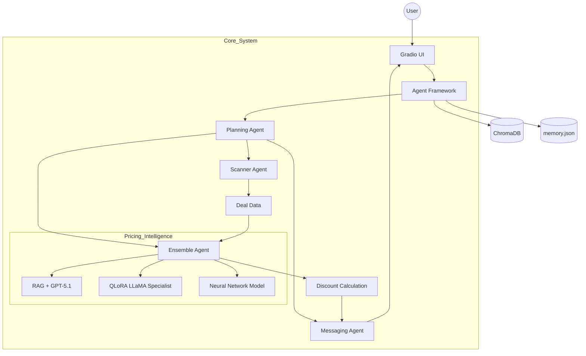

# DealPilot

[](https://www.python.org/) [](https://openai.com/) [](https://www.trychroma.com/) [](https://gradio.app/)

DealPilot is an autonomous multi-agent system that discovers, analyzes, and evaluates online deals. It combines RAG with GPT-5.1, a QLoRA fine-tuned LLaMA specialist agent, and a neural network model to estimate true product value, identify high-discount opportunities, and deliver intelligent alerts with visualization.


---

## System Architecture and Workflow


## Methodology

To design a robust pricing system, multiple approaches were systematically evaluated using Mean Squared Error (MSE) as the primary metric.

### Approach

- Started with baseline models such as Constant prediction and Linear Regression to establish reference performance  
- Introduced traditional ML models including Random Forest and XGBoost for improved numerical estimation  
- Integrated NLP-based methods and neural networks to capture textual and feature-based patterns  
- Evaluated large language models for contextual reasoning and price understanding  
- Applied fine-tuning (QLoRA on LLaMA 3.2) to create a domain-specific Specialist Agent  
- Enhanced performance further using Retrieval-Augmented Generation (RAG) with GPT-5.1  

### Key Insight

No single model performed best across all scenarios. While LLMs provided strong reasoning and neural networks offered stable predictions, combining them led to significantly better results.

### Final Methodology

The final system uses an ensemble approach combining:
- GPT-5.1 with RAG for contextual reasoning  
- Specialist Agent for domain-specific accuracy  
- Neural Network for numerical stability  

This hybrid design achieved the lowest error and forms the core of DealPilot.


## Key Features

### Autonomous Multi-Agent System
- Fully automated pipeline from scraping to evaluation and alerting  
- Coordinated by a Planning Agent  

### Hybrid Pricing Intelligence
- RAG with GPT-5.1 for context-aware reasoning  
- Specialist Agent using QLoRA fine-tuned LLaMA 3.2  
- Neural Network Agent for numerical estimation  

Final price is derived using ensemble logic.

### Real-Time Deal Discovery
- Scrapes deals from RSS feeds  
- Extracts structured product information  

### Intelligent Discount Detection
- Discount = estimated_price - acutal_price
- Filters high-value opportunities  

### Notification System
- Generates alert messages using GPT  
- Sends push notifications Using PushOver

### Visualization
- Uses TSNE for embedding visualization  
- Provides fallback visualization when data is limited  

---

## Tech Stack

### Core
- Python 3.9+  
- Gradio  
- ChromaDB
- Beautiful Soup
- Pushover

### AI and ML
- GPT-5.1  
- RAG pipeline  
- LLaMA 3.2 (QLoRA fine-tuned)  
- PyTorch  

### Data Processing
- RSS feeds and Selenium  
- TSNE (scikit-learn)  
---

## Agent Architecture

| Agent | Role |
|------|------|
| Planning Agent | Orchestrates workflow |
| Scanner Agent | Scrapes deals |
| Ensemble Agent | Combines pricing models |
| Specialist Agent | Fine-tuned domain model |
| Neural Network Agent | Price estimation |
| Messaging Agent | Sends alerts |

---

## Example Logic

Input Deal:  
iPhone listed at 500 dollars  

System Estimation:
RAG = 650 dollars
Specialist = 630 dollars
Neural Net = 640 dollars

Estimated Value = 640
Discount = 140

Final output = 640 - 500
discount = 140 dollars (sends the Notification about the deal)

## Installation and Setup

```bash
git clone <your-repo-link>
cd DealPilot

pip install -r requirements.txt
python price_is_right.py
```

## Highlights

- Multi-agent architecture  
- Hybrid AI system  
- Autonomous decision-making  
- End-to-end pipeline  
- Visualization and alerts  


